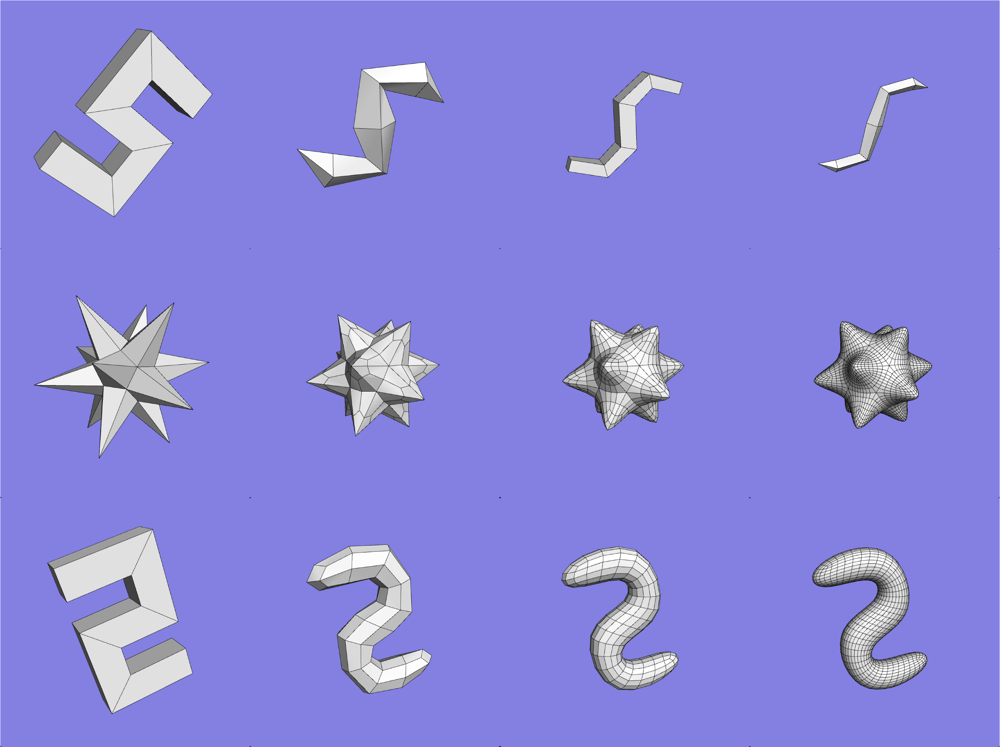

# Catmull-Clark Subdivision, Dual Operation, Laplacian Smoothing, and Taubin Smoothing

  

## Getting Started
Key bindings for the program are as follows:

1-7: Read in a mesh file (octahedron, cube, icosahedron, dodecahedron, star, torus, S).

f: Toggle between per-face and per-vertex normals.

w: Toggle between white and randomly colored faces.

e: Toggle between not showing and showing the mesh edges in black.

v: Toggle visualization of a directed edge on / off

n: Change the current edge using the "next" operator.

p: Change the current edge using the "previous" operator.

o: Change the current edge using the "opposite" operator.

s: Change the current edge using the "swing" operator.

u: Change the current edge using the "unswing" operator.

d: Create and display the dual of the mesh (you should be able to do this an unlimited number of times).

g: Perform midpoint subdivision of the mesh and project vertices to sphere (you should be able to do this an unlimited number of times).

c: Perform Catmull-Clark subdivision (you should also be able to do this an unlimited number of times).

r: Add random noise to the mesh by moving the vertices in the normal direction (both in and out).

l (lower case "L"): Perform Laplacian smoothing (40 iterations).

t: Perform Taubin smoothing (40 iterations).

## Features
- Dual Operation
- Catmull-Clark Subdivision
- Midpoint Subdivision to create geodesic sphere
- Laplacian Smoothing
- Taubin Smoothing
- Random Noise to the mesh
- Visualization of a directed edge
- Edge operators: next, previous, opposite, swing, unswing
- Vertex normals
- Mesh Coloring